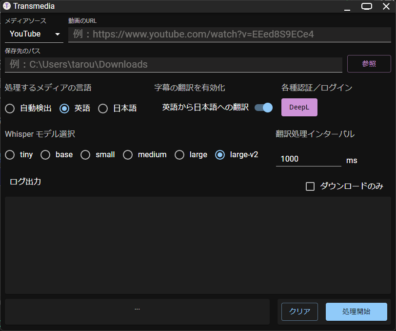
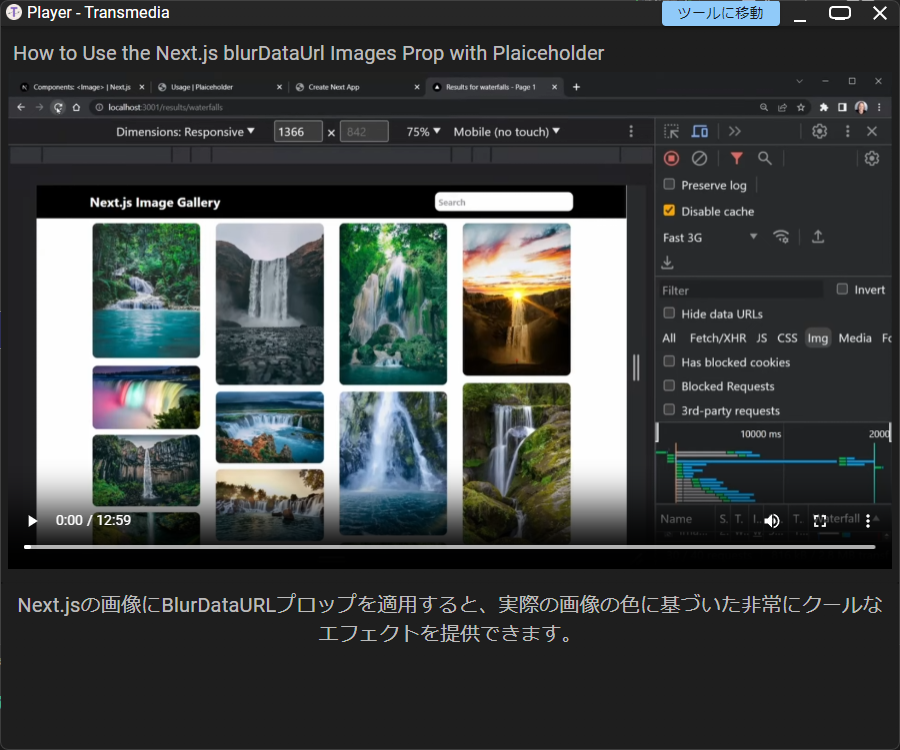

# transmedia
 メディアの文字お越しと翻訳、専用のプレイヤーを搭載したアプリケーションです。

## 概要
子のアプリは、海外の動画コンテンツや音声コンテンツ（主に英語）を、言語の壁なく気軽に日本語で視聴したいという思いから制作しました。やはり、海外の情報はタイムリーで新鮮です。このプログラムは、任意の動画ファイル（mp4、webm）とYouTubeの動画から、OpenAIのWhisperモデルを使い、正確な字幕を抽出し、高品質翻訳エンジンDeepLで字幕を翻訳します。  
※余力があればローカルの音声ファイルにも対応します。

## 必須環境
+ Windows 10 / 11
+ Python v3.X.X
  + faster-whisper: 音声・動画から話者が発話しているテキストを抽出する
  + yt-dlp: YouTubeから動画をダウンロードする
  + pytorch: 機械学習に使用する

Pythonはインストールして、「python」コマンドが使えるようにパスを通しておいてください。 
必要なPythonの依存ライブラリは3つあるので、全て「pip」でインストールします。 
「pytorch」は、CPUバージョンとGPU（cuda）バージョンがあり、自分のPCにグラフィックボードが搭載されている場合はcudaバージョンをおすすめします。少しインストールに手間がかかりますが、処理が格段に速くなります。

## アプリの使い方

まず起動したら、こんな画面になるので、順番に必要項目を入力して、最後に「処理開始」をクリックして終了です。 

上から順番に・・・
1. メディアソース：どこからメディアファイルを取得するか選択します。
2. 動画のURL：メディアソースでYouTubeを選択した場合は動画のURLを入力します。ローカルを選択した場合は、動画ファイルが保存されているパスを入力するか、「参照」ボタンから動画ファイルを選択します。
3. 保存先のパス：処理中に生成される動画ファイルを含むファイル軍が作成されるパスを入力しま
す。
4. 処理するメディアの言語：処理を行うメディアファイルの言語を選択します。現状では英語と日本語しか用意していません。「自動兼室」はできるようになっていますが、DeepLで後に翻訳処理をかける場合、英語以外の言語が入力されるとバグる可能性があります。
5. 字幕の翻訳を有効化:ここでDeepLによる翻訳をかけるかの選択を行います。
6. 各種認証／ログイン：現在「DeepL」のクライアントが起動するようになっていますが、DeepLのプロプランに加入している場合は、処理が安定するのでログインしておくことをおすすめします。
7. Whisper モデル選択：こちらは、選択するモデルの種類によって文字お越しの正確性が変わります。左から「tiny」（最低ー処理が軽い）～「large-v2」（最高ー処理重め）となります。また、モデルのサイズが上がるほど、メモリー使用量も増加するので、8GB以上のRAMが推奨されます。メモリー不足で使えない場合は、エラーが発生します。
8. 翻訳処理インターバル：DeepLで翻訳処理を行う際の処理感覚になります。本アプリでは、DeepLのWebクライアントをスクレイピングする形で翻訳処理をしているため、あまり処理感覚が早すぎるとサーバーに負荷をかけてしまいます。  

次にプレイヤーについてです。プレイヤーは、翻訳された字幕とともに、動画を再生します。  

翻訳処理後の指定した保存パスを開くと、「run-player.tsap」というファイルが生成されているので、こちらをダブルクリックするとプレイヤーが起動します。  

シンプルなプレイやーになっていますが、スクリーンリーダーにも対応しているため、字幕が更新されるたびに読み上げてくれます。

## 免責事項
+ 本プログラムは、字幕の抽出制度、翻訳されたテキストに対する品質を保証するものではありません。
+ 本プログラムを利用して起きた、不利益・損害に対して開発元は一切責任を負わないものとします。

## ライセンス
MIT License. 
改変・再配布などご自由にどうぞ。 
Electronで開発しているので、TypeScriptとPythonが分かれば容易に編集できます。